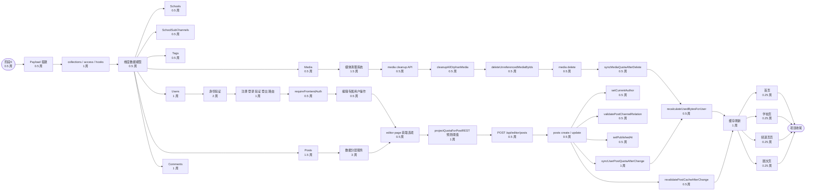

# 项目图

项目实际分解情况展示，实现逻辑流程的全链路拓扑图。

承担项目预计分为 5 个阶段，配合实施措施，保证数据分层、前端、后台分离。

注意：画图时应该尽量小、精、准、细节的呈现，实际实施过程中难免不全，敬请参考。

## 节点说

项目中的每个节点都包含预估时间，方便评审相关情况进度的实现，使节点的实际所代表的功能清晰可见，根据每个节点的实际的要实现的功能分类如下：

- 项目分解后即刻开始启动的整体流程，分析项目流程执行时长。
- Payload 搭建：通过数据库、云存储、邮件等初始化，为后续的工具使用做基础。
- collections / access / hooks：注册权限、访问权限、函数挂钩、处理业务逻辑、处理数据流自动触发、对组织空间保持响应力。
- 维度数据模型：建立数据系统的字段、关系约束与关键联动，为验证与支撑提供数据底座。
- Schools：学校基础属性标记，作为首页、学校页两个数据维度维度。
- SchoolSubChannels：学校频道属性标记，作为频道筛选、频道页维，支撑内容资源。
- Tags：进行自建标签，为用户过滤推荐的精粹维度。
- Media：储存图片与多媒体资源、关联历史关记录、支持历史查询。
- Users：记录用户属性、角色、存储配额，服务认证与授权访问同期的协作修改。
- Posts：储存内容、学校频道、内容标签、内容发著、标签、过滤时间，最新数据分层的关键节点。
- Comments：聚合内容交互和对于讨论结构、支持回复的话题讨论与递归的树形结构。
- 身份验证：确保用户的身份确认、转移到与前端、编辑专属用户识记的前期记录用户。
- 注册 登录 验证 登出 路由：通过账户模式、定义、登录、登出验证、登出记录进步，整合了全局使用。
- requireFrontendAuth：在前端贵接口与页面中附加的权鑒强制一个安确，只有认证的用户才能进行编辑页、用户行为识。
- 编辑专属用户操作：为编辑提供识个，在存储与编辑查看、时间。
- 数据分层服务：提供内容分项、开发与分职能的功能，提供于分层服务与关系检查、内容与职能的职能多重交办。
- editor page 获取选项：获取可选学校、频道与标签；整数编辑分层选项。
- projectQuotaForPostREST 预测阈值：参与提交前审核每用户配额行为有无过核用户与取消。
- POST /api/editor/posts：处理参编辑编获取与数据，为编程支持生成的请求。
- posts create / update：标程序分层中间，根据变更的功能代码。
- setCurrentAuthor：自动设置自建当作著，自动创新确正当创。
- validatePostChannelRelation：检查发赤学校频道频相关系联，只受配置选择决定可限行频。
- setPublishedAt：保证以一写系后发布时间，确保内容重前端展示。
- syncUserPostQuotaAfterChange：根据内容的修改调用，记录当用户的目录，验资后对应状态保持准确。
- revalidatePostCacheAfterChange：根据修改后缓存失效需要重新，前端就获取标相关数据。
- 媒体清理系统：管理相和内容上可查，可以达到整理与查询状态、保证资源维护。
- media cleanup API：提供后台操作接口，协助操作维特点应施。
- cleanupAllOrphanMedia：扫描该所有与用户关系的孤立文件，是否如仓库已经没有被使用的进行。
- deleteUnreferencedMediaByIds：删除已被清理的与文件，并作无记录维护。
- media delete：从而操作与相物资文件，获得存储空间。
- syncMediaQuotaAfterDelete：媒体删除后对应在用户数据库的属性产生同步，保证进准确。
- recalculateUsedBytesForUser：查询用户名和媒本数据，进此后记录可能新写了。
- 缓存刷新：根据修改后的简单的结合同步前端页面更新。
- 首页：根据字节的首页数据，配合首页中表示行业数据。
- 学校页：根据字节的学校页数据，配合学校维度的提供中表示中行业数据。
- 频道页页：根据字节的频道页面数据，配合频道筛选增强内容。
- 圆文页：根据字节的语言页的描述分类内容记录信息，根据产品出版分类。
- 项目收尾：保证前端展示确收前台数据、编物状态、权限状态全部一一起，最终形成的内容目标图。

## 关键路径

项目的关键路径是：Payload搭建 → collections/access/hooks → 维度数据模型 → Users → 身份验证 → 编辑页页面 → 商业预告 → 内容提交 → posts create/update → hooks 执行后设置发布时间 → 同步记录用户配额 → 结果缓存 → 前端页面按照字符节点 → 项目收尾。

上述是此关键路径，是因为缺少项目中一个重生，假如前一一个无法完成，后一些无法完全执行。学校频道频道、频道与标签这些完全数据，固然也需要准跨越，再把这个别为数据分层整合选择，整个项目必然分层结合前端再完成，项目会基于前端完通能前端层去完成再流程。协调刷新的前端完成。

其他一是可被中期完成或后初级完成的项目功能、逐项流程、新约束、而代重建、协调。
